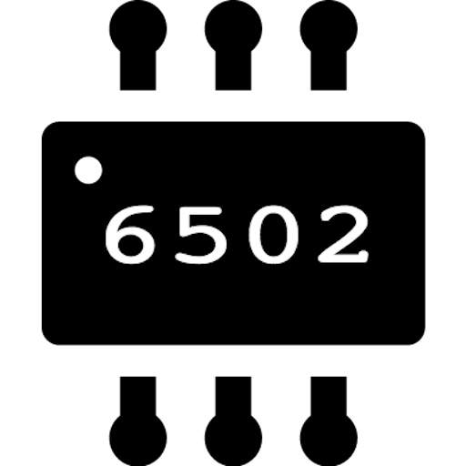

# Hi there, I'm Mauro!
### Game Engine Developer | Graphics Programmer

  

  
  

---

## Tech Stack

  
  
  
  
  

---

## Stats

  <table border="0">
    <tr>
      <td>
        
      </td>
      <td>
        
      </td>
    </tr>
  </table>

---

## Connect with me

  
  &nbsp;&nbsp;&nbsp;&nbsp;&nbsp;&nbsp;
  

---
